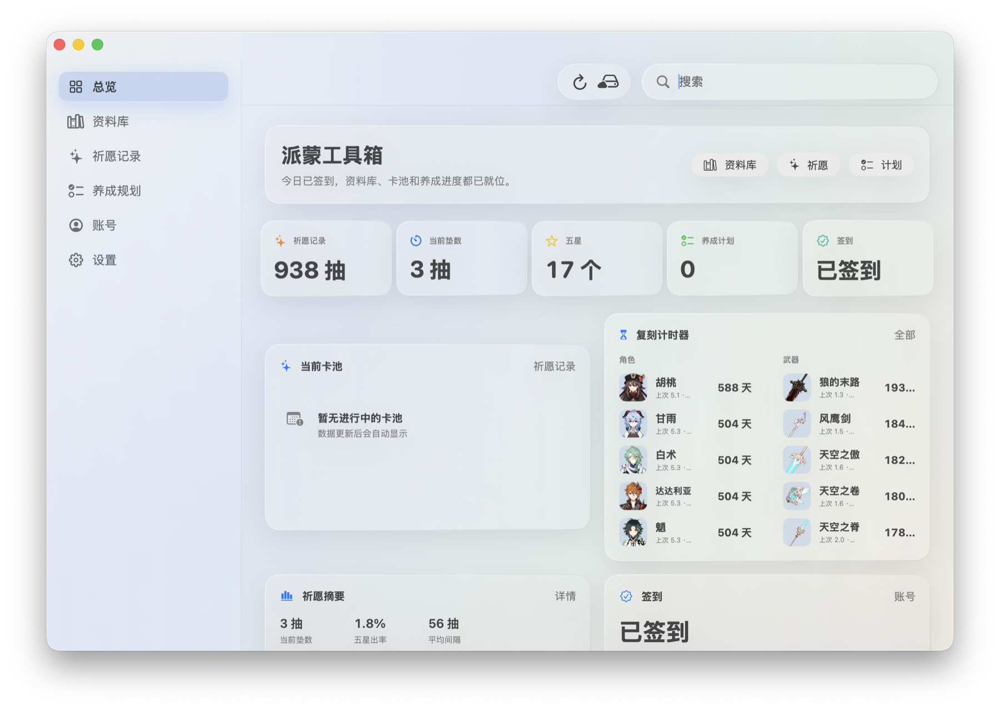

<p align="center">
  
</p>

# 派蒙工具箱

派蒙工具箱是一个 macOS 原神工具应用，当前包含资料库、祈愿记录分析、角色培养规划、米游社扫码登录签到、桌面小组件和远程数据更新能力。

本项目是非官方工具，和 HoYoverse / 米哈游没有从属关系。



## 功能

- 角色、武器、材料资料库
- 角色养成材料与培养规划
- 祈愿记录导入、统计和复刻间隔展示
- 米游社扫码登录与每日签到
- macOS 桌面小组件
- GitHub Pages 在线数据更新
- 离线 `data-pack-YYYY.MM.DD.zip` 导入兜底

## 数据来源

App 默认从公开数据仓库读取生成后的 JSON：

```txt
https://nikolai1997.github.io/paimon-toolbox-data/metadata.json
```

当前数据生成链路见 [docs/data-source-configuration.md](docs/data-source-configuration.md)。

基础资料主要来自公开项目 `theBowja/genshin-db`，卡池信息来自 `SnapHutaoRemasteringProject/Snap.Metadata`，公告来自米哈游官方公告接口。生成后的数据由独立数据仓库发布，App 不直接依赖上游项目运行。

## 安装

当前发布包没有使用 Developer ID 签名，也未经过 Apple 公证。首次打开时，macOS 会提示无法验证开发者，这是未公证 App 的系统行为。

1. 打开 DMG，把“派蒙工具箱”拖入“应用程序”。
2. 在 Finder 的“应用程序”中右键“派蒙工具箱”，选择“打开”。
3. 在再次出现的提示中选择“打开”。
4. 如果仍被阻止，进入“系统设置” > “隐私与安全性”，在安全性提示旁选择“仍要打开”。

请只从本项目的 GitHub Releases 获取安装包。每次更新后，macOS 可能会再次要求确认。

## 本地开发

需要 macOS 14+ 和 Xcode / Swift 6 工具链。

运行测试：

```bash
swift test --disable-sandbox
```

启动并做自检：

```bash
./script/build_and_run.sh --verify
```

生成 DMG 安装包：

```bash
./script/package_dmg.sh
```

安装包输出到：

```txt
dist/PaimonToolbox-<version>.dmg
```

## 数据更新工具

本仓库内保留一份生成脚本，便于本地更新内置数据：

```bash
python3 script/update_remote_data.py \
  --source genshin-db \
  --gacha-source snap-metadata \
  --manual-dir data/manual \
  --fetch-official-announcements \
  --public-dir data/public \
  --release-dir data/releases
```

## 许可证

代码以 MIT License 开源。第三方项目的版权与许可声明见 [THIRD_PARTY_NOTICES.md](THIRD_PARTY_NOTICES.md)。游戏素材、名称、图标和公告的权利归其各自权利方所有。
